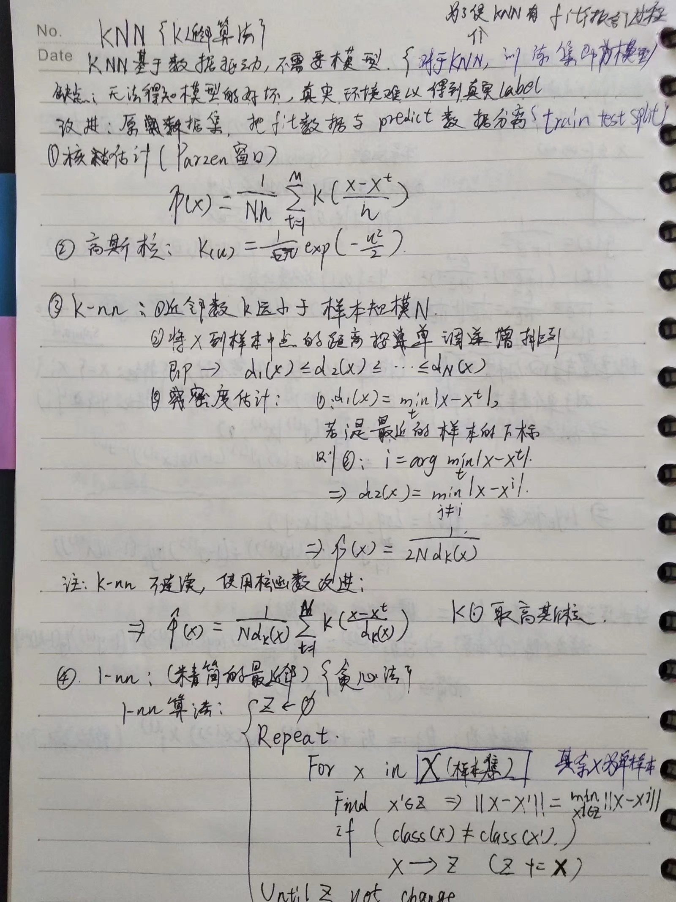
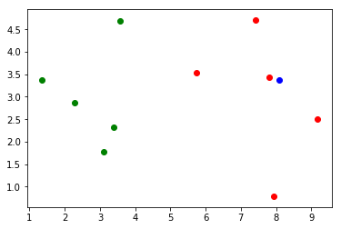

# KNN K近邻算法{分类，回归}




```python
import numpy as np
import matplotlib.pyplot as plt

raw_data_x =[[3.393533211,2.331273381],
             [3.110073483,1.781539638],
             [1.343808831,3.368360954],
             [3.582294042,4.679179110],
             [2.280362439,2.866990263],
             [7.423436942,4.696522875],
             [5.745051997,3.533989803],
             [9.172168622,2.511101045],
             [7.792783481,3.424088941],
             [7.939820817,0.791637231],
            ]
raw_data_y =[0,0,0,0,0,1,1,1,1,1]
```


```python
x_train = np.array(raw_data_x)
y_train = np.array(raw_data_y)
```


```python
x = np.array([8.093607318,3.365731514])
```


```python
plt.scatter(x_train[y_train == 0,0],x_train[y_train == 0,1],color = "g")
plt.scatter(x_train[y_train == 1,0],x_train[y_train == 1,1],color = "r")
plt.scatter(x[0],x[1],color = "b")
plt.show()
```





## KNN过程


```python
from math import sqrt
#先计算新的点，到全部样本的距离
distance = []#距离
for x_tra in x_train:
    d = sqrt(np.sum((x_tra - x)**2))#得到一个向量，是两个向量对应相减,E(i..m)(Xi^a-Xi^b),再开根就是欧拉几何距离
    distance.append(d)
distance

#可以写成一句话:
distances = [sqrt(np.sum((x_tra - x)**2)) for x_tra in x_train]
distances
```


    [4.812566907609877,
     5.229270827235305,
     6.749798999160064,
     4.6986266144110695,
     5.83460014556857,
     1.4900114024329525,
     2.354574897431513,
     1.3761132675144652,
     0.3064319992975,
     2.5786840957478887]


```python
#排序{从近到远},并返回索引
nearest = np.argsort(distances)
nearest
```


    array([8, 7, 5, 6, 9, 3, 0, 1, 4, 2], dtype=int64)


```python
K = 6
```


```python
#通过索引，取得样本的分类标记
nearest_label = [y_train[i] for i in nearest[:K]]#通关前6个距离最近的点的索引，得到距离最近的点的分类
nearest_label
```


    [1, 1, 1, 1, 1, 0]


```python
#对nearest_label中元素的频次进行统计
from collections import Counter
votes = Counter(nearest_label)#返回字典,存入投票器
votes
```


    Counter({0: 1, 1: 5})


```python
votes.most_common(2)#票数最多的n个元素
```


    [(1, 5), (0, 1)]


```python
predict_label = votes.most_common(1)[0][0]#预测的label
predict_label
```


    1


### KNN function()

```python
import numpy as np
from math import sqrt
from collections import Counter

def KNN_classifier(k,X_train,Y_train,x):
    #assert
    assert 1 <= k <= X_train.shape[0],"k must legal"
    assert X_train.shape[0] == Y_train.shape[0],"the lines of X_train & Y_train must be equal"
    assert X_train.shape[1] == x.shape[0],"the columns of X_train & x must be equal"
    #Algorithm
    distances = [sqrt(np.sum((x_train - x)**2)) for x_train in X_train]
    nearest = np.argsort(distances)

    nearest_label = [Y_train[i] for i in nearest[:k]]
    votes = Counter(nearest_label)

    return votes.most_common(1)[0][0]
```


```python
%run ML/KNN_function.py
predict = KNN_classifier(K,x_train,y_train,x)
predict
```


    1


### KNNclass

```python
import numpy as np
from math import sqrt
from collections import Counter

class KNNclassifier:
    
    def __init__(self, k):#构造函数
        assert k >=1 ,"k must legal"
        
        self.k = k
        self._X_train = None
        self._Y_train = None
    
    def fit(self,X_train,Y_train):#fiting model
        assert X_train.shape[0] == Y_train.shape[0],"the lines of X_train & Y_train must be equal"
        assert self.k <= X_train.shape[0],"the size of X_train must be at least k"
    
        self._X_train = X_train
        self._Y_train = Y_train
        return self
        
    def predict(self,X_predict):
        assert self._X_train is not None and self._Y_train is not None,"must fit before predict"
        assert X_predict.shape[1] == self._X_train.shape[1],"the columns of X_predict & X_train must be equal"
        label_predct = [self.alone_predict(x) for x in X_predict]
        return np.array(label_predct)
    
    def alone_predict(self,x):
        assert self._X_train.shape[1] == x.shape[0],"the columns of X_train & x must be equal"
        #Algorithm
        distances = [sqrt(np.sum((x_train - x)**2)) for x_train in self._X_train]
        nearest = np.argsort(distances)
        
        nearest_label = [self._Y_train[i] for i in nearest[:self.k]]
        votes = Counter(nearest_label)
        
        return votes.most_common(1)[0][0]
        
    def __repr__(self):
        return "KNN(k=%d)" % self.k
```


```python
%run ML/KNNclassfy.py
knn = KNNclassifier(k=6)
knn.fit(x_train,y_train)
knn.predict(x.reshape(1,-1))
```


    array([1])


## 使用scikit-learn中的KNN


```python
from sklearn.neighbors import KNeighborsClassifier#加载算法 

KNN_classifier = KNeighborsClassifier(n_neighbors=6)#创建一个实例，n_neighbors =K

KNN_classifier.fit(x_train,y_train)#拟合,模型存于实例中
```


    KNeighborsClassifier(algorithm='auto', leaf_size=30, metric='minkowski',
               metric_params=None, n_jobs=1, n_neighbors=6, p=2,
               weights='uniform')


```python
KNN_classifier.predict(x.reshape(1,-1))#预测的数据必须是一个矩阵，否则ValueError
```


    array([1])


