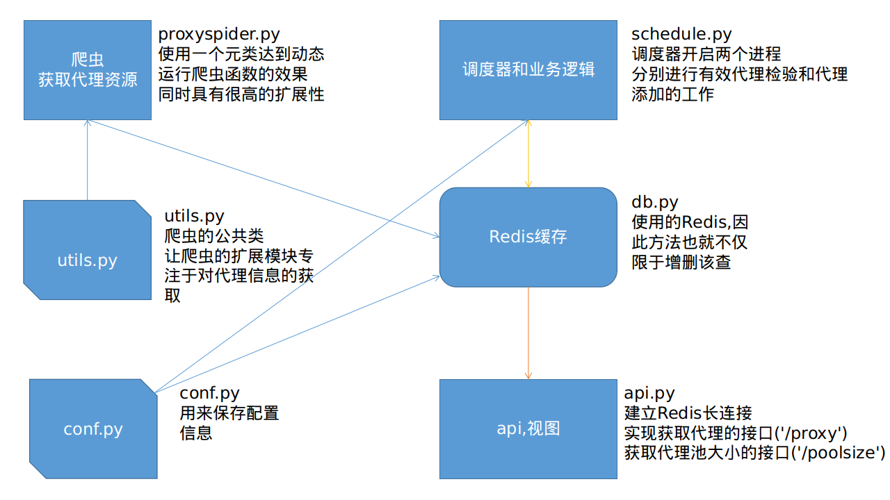

# 这是一个使用flask和rdeis实现的动态代理池

Proxy pool run whith python3.6

# Proxy pool
## 代理池的要求：
1. 多站抓取，异步检测
2. 定时筛选，持续更新
3. 提供接口，易于抓取

## 代理池架构

代理网站 --> 抓取器 -->过滤器 --> 代理队列(提供可用代理) --> 定时检测

api会提供代理队列中可用的代理

## 安装使用以及更新

###　安装:(Ubuntu18.04)

#### 在一个虚拟环境中安装
##### 安装virtualenv
`pip3 install virtualenv`
##### 建立py3.6的虚拟环境
`virtualenv -p /usr/bin/pyhton3.6 myclient`
##### 启动虚拟环境
`source myclient/bin/activate`
##### 下载源码(你也可以直接从这一步开始)
`git clone https://github.com/Euraxluo/ProxyPool`
##### cd ProxyPool
`cd ProxyPool`
##### 修改配置
`vim proxypool/conf.py`
##### 开始安装代理池
`python setup.py install`

### 使用代理池

#### 安装完毕后,cd 到虚拟环境的bin下
`cd ..`

`cd myclient/bin`
#### 启动代理池服务
`python proxypool_run`

####　更新：（指的是我，记录一下）

修改setup.py的version号

但不要更改console_scripts

### 项目学习模仿的静觅大神的开源项目:https://github.com/Germey/ProxyPool
